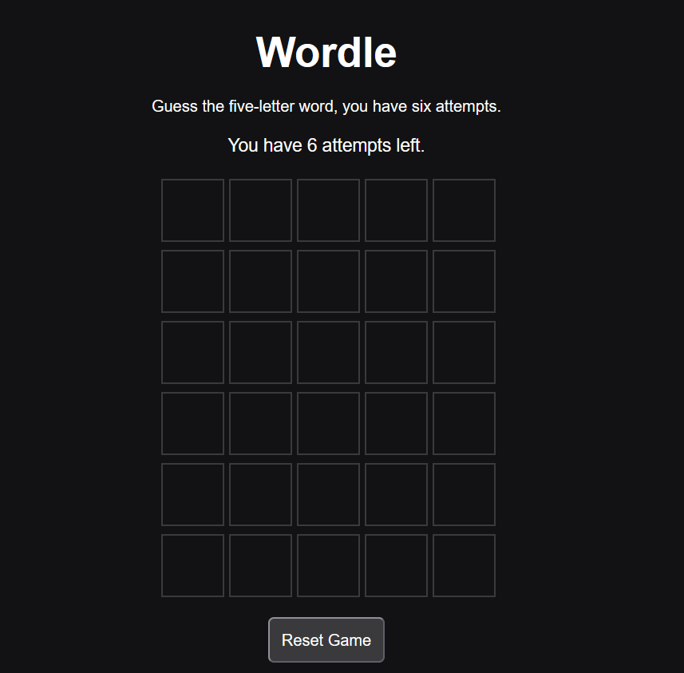
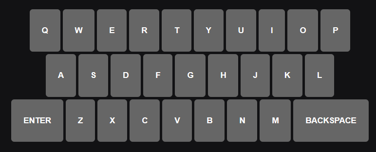

# Wordle

## Description

This is a replicated browser game of the original Wordle, built using HTML, CSS, and JavaScript.

The player has six attempts to guess a randomly selected five-letter word. After each guess, the tiles and on-screen keyboard change colour to provide feedback:

- Green means the letter is correct and in the correct position.
- Yellow means the letter exists in the word but is in the wrong position.
- Gray means the letter is not in the word.

The game supports both a physical keyboard and an on-screen keyboard.

## Getting Started

Play the deployed game here:

[Play Wordle](https://github.com/HAli12-hat/Wordle-Project)

To play locally:

1. Download or clone the repository.
2. Open the project folder.
3. Open `index.html` in a web browser.
4. Enter a five-letter guess using the physical or on-screen keyboard.
5. Press Enter to submit the guess.

## Features

- Random five-letter word selection
- Six attempts per game
- Correct repeated-letter handling
- Physical keyboard controls
- On-screen keyboard controls
- Keyboard colour tracking
- Tile flip animations
- Reset button
- Replay button
- Win and loss messages
- Responsive layout

## Technologies Used

- HTML
- CSS
- JavaScript
- Git
- GitHub

## Future Improvements

- Use a much larger dictionary
- Add win/lose stat tracking 
- Add a dark and light theme option
- Add difficulty settings
- Invalidate the submission if it isn't a real word

